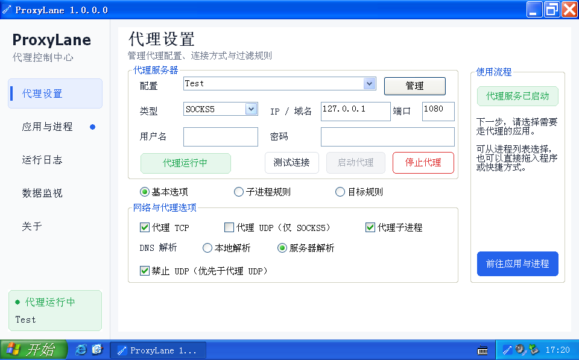

[简体中文](README.md) | [English](README_EN.md)

# ProxyLane

ProxyLane 是一款面向 Windows 的应用进程级透明代理工具。它通过进程注入和网络 API Hook，让指定程序的网络连接使用单独配置的代理，而不需要修改系统全局代理。

## 界面预览



## 使用场景

### 代理命令行工作区

首先启动代理（代理设置需已勾选“代理子进程”），然后打开一个在命令提示符，在 ProxyLane 的应用与进程中，选中新增的 `cmd.exe` 并点击“代理所选”按钮。此后从该命令行窗口启动的 `curl`、Git、Python、`pip`、包管理器及其他程序，都会自动继承当前代理设置，无需逐个添加程序，也不需要修改系统全局代理。

例如：

```bat
curl https://example.com
git clone https://github.com/example/project.git
pip install requests
python script.py
```


## 功能

- 对指定应用或进程透明代理
- 支持代理配置管理和连接测试
- 支持 HTTP / SOCKS5 TCP 与 UDP 代理
- 支持进程规则和目标规则
- 支持直接拖入程序或快捷方式启动
- 提供运行日志和连接数据监视
- 提供 Win32 与 x64 版本
- 兼容 Windows XP 至 Windows 11

## 技术路线

ProxyLane 采用纯用户态的进程注入与 API Hook 技术，对应用程序的网络连接进行拦截和重定向，不安装或加载内核驱动，也不需要修改系统全局代理。

- 将与目标进程位数匹配的 Hook 模块注入用户选定的进程，拦截其网络 API，并将符合规则的 TCP、UDP 网络连接重定向到指定代理。
- 通过 Hook 监控进程创建行为。启用“代理子进程”后，每一级已注入进程都会继续监控其子进程，因此可以沿进程链处理多级子进程，并根据过滤规则决定是否继续注入。
- 对需要代理的子进程，Hook 模块的加载和初始化会在该子进程的主线程上下文中完成；初始化成功后才恢复主线程执行，使网络 Hook 在应用程序发起网络连接前就绪，从而可靠地拦截其后续网络行为。
- 主程序负责代理配置、过滤规则和日志展示，Hook 模块负责监控子进程创建及网络行为。整个过程均在用户态完成。
- 同时提供 Win32 和 x64 组件，兼容范围从 Windows XP 到 Windows 11。

## 构建环境

- Visual Studio 2019
- Visual C++ v141_xp 工具集
- Windows 7.1A SDK

打开 `src/ProxyLane.sln`，选择 `Win32` 或 `x64` 平台后构建即可。Release 输出位于 `bin/` 目录。

### gonc TLS-PSK 加密传输

SOCKS5、HTTP10 和 HTTP11 配置都可以在“加密模式”中选择 `gonc TLS-PSK`，并填写与远端 gonc `:s5s` 服务一致的 PSK。SOCKS5 支持加密 TCP 与 UDP；HTTP10/HTTP11 使用加密的 HTTP CONNECT，仅支持 TCP，不需要在本机另外启动 gonc 客户端或标准代理中转。

远端 gonc 默认只启用 SOCKS5。若要让同一个 TLS-PSK 端口同时接受 SOCKS5 和 HTTP，请在内置服务参数中增加 `-http`，例如 `gonc -e ":s5s -u -http" -l -k -psk 123 -tls 1083`。

PSK 按初版设计以明文写入所选 profile 的 `PSK=` 字段，请妥善限制 `ProxyLane.ini` 的访问权限。标准（不加密）模式不加载加密组件。

加密实现位于可选的 `ProxyLaneSecureTransport32.dll` 和 `ProxyLaneSecureTransport64.dll`。主程序及 Hook DLL 仍使用 `v141_xp` 构建，未选择加密模式时不会加载这两个 DLL。构建加密组件需要 Rust MSVC 工具链：

```bat
src\build-secure-transport.bat
```

该批处理会自动构建 Win32、x64 两个 Release 版本，并复制到 `bin/`。也可以直接运行底层 PowerShell 脚本：

```powershell
powershell -ExecutionPolicy Bypass -File .\scripts\build-secure-transport.ps1
```

## 界面语言

ProxyLane 内置简体中文和英文。默认跟随 Windows 界面语言，也可以在“关于与语言”页面选择语言；修改后在下次启动时生效。

全部可翻译文字保存在 UTF-8 语言目录中：

- `src/ProxyLane/locales/zh-CN.json`
- `src/ProxyLane/locales/en-US.json`

两份文件必须保持相同的键集合。`ProxyLane.rc` 只维护控件布局，语言目录作为 `RCDATA` 嵌入 EXE，因此发行包不需要附带外部语言文件。

修改翻译后可运行 `powershell -ExecutionPolicy Bypass -File .\scripts\check-locales.ps1` 检查语言键和资源文件。

## 打包发行版

先构建 Win32 与 x64 的 Release 版本，然后在项目根目录运行：

```powershell
powershell -ExecutionPolicy Bypass -File .\scripts\package-release.ps1
```

脚本会从程序文件属性读取版本号，检查主程序与 Hook DLL 的版本是否一致，并生成 `dist/ProxyLane-版本-Windows.zip`。压缩包包含 Win32/x64 主程序、对应的 Hook DLL、两个加密传输 DLL、样例配置以及中英文 README。

样例配置保存在 `examples/ProxyLane.ini`，打包后会以 `ProxyLane.ini` 放在压缩包根目录。

如需指定输出目录，可增加参数 `-OutputDirectory D:\releases`。

## 项目结构

- `src/ProxyLane`：MFC 桌面界面与应用逻辑
- `src/ProxyLaneHook`：进程注入与网络 Hook 模块
- `src/remotecode`：远程代码执行辅助模块
- `tests`：单元测试
- `examples`：样例配置
- `scripts`：发行包生成脚本
