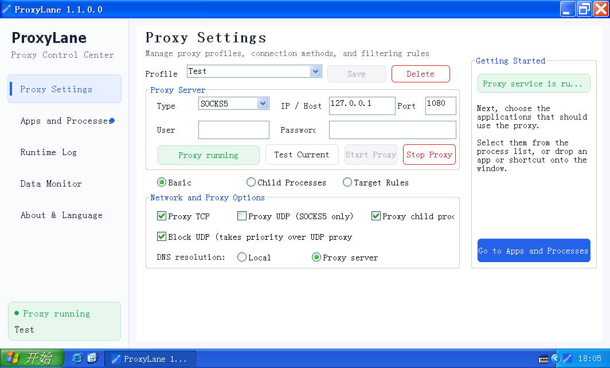

[简体中文](README.md) | [English](README_EN.md)

# ProxyLane

ProxyLane is an application-level transparent proxy for Windows. It uses process injection and network API hooks to route selected applications through a separately configured proxy without changing the system-wide proxy settings.

## UI Preview



## Use Case

### Proxy a Command-Line Workspace

First, start the proxy with **Proxy child processes** enabled. Open a Command Prompt, select the new `cmd.exe` entry under **Apps and Processes**, and click **Proxy Selected**. Programs launched from that command-line window—including `curl`, Git, Python, `pip`, package managers, and other tools—will automatically inherit the active proxy settings. You do not need to add every child process separately or change the system-wide proxy.

For example:

```bat
curl https://example.com
git clone https://github.com/example/project.git
pip install requests
python script.py
```

## Features

- Transparent proxying for selected applications and processes
- Proxy profile management and connection testing
- HTTP and SOCKS5 support for TCP and UDP traffic
- Child-process and destination filtering rules
- Launch and proxy applications by dropping programs or shortcuts into the window
- Runtime logs and proxied connection data monitoring
- Win32 and x64 builds
- Compatible with Windows XP through Windows 11

## How It Works

ProxyLane uses user-mode process injection and API hooking to intercept and redirect application network connections. It does not install a kernel driver or modify the system-wide proxy settings.

- A Hook module matching the target process architecture is injected into a user-selected process. It intercepts network APIs and redirects matching TCP and UDP connections through the configured proxy.
- The Hook monitors process creation. When **Proxy child processes** is enabled, every injected process continues monitoring its descendants, allowing ProxyLane to handle multiple generations of child processes according to the configured filters.
- For a child process that must be proxied, the Hook module is loaded and initialized in that process's main-thread context. The main thread resumes only after initialization succeeds, ensuring the network hooks are ready before the application opens connections.
- The main application manages proxy profiles, filtering rules, and logs. The Hook module monitors child-process creation and network activity. The entire workflow runs in user mode.
- Win32 and x64 components are provided for compatibility with Windows XP through Windows 11.

## Build Environment

- Visual Studio 2019
- Visual C++ v141_xp toolset
- Windows 7.1A SDK

Open `src/ProxyLane.sln`, select the `Win32` or `x64` platform, and build the solution. Release binaries are written to `bin/`.

### gonc TLS-PSK transport

For a SOCKS5 profile, select `gonc TLS-PSK` under **Transport** and enter the same PSK used by the remote gonc `:s5s` server. Both TCP and UDP use the encrypted SOCKS5 service directly; no local gonc client or standard SOCKS5 bridge is required.

In this initial format, the PSK is stored as plaintext in the profile's `PSK=` field. Protect access to `ProxyLane.ini` accordingly. Secure transport is available only for SOCKS5, and plain HTTP/SOCKS5 profiles do not load the secure component.

The secure implementation is isolated in the optional `ProxyLaneSecureTransport32.dll` and `ProxyLaneSecureTransport64.dll`. The application and Hook DLLs remain built with `v141_xp`, and the secure DLLs are not loaded unless the profile selects secure transport. Build them with the Rust MSVC toolchain:

```powershell
powershell -ExecutionPolicy Bypass -File .\scripts\build-secure-transport.ps1
```

## Interface Languages

ProxyLane includes Simplified Chinese and English. By default, it follows the Windows UI language: Chinese systems use Simplified Chinese, while all other systems use English. You can also select a language on the **About & Language** page; the change takes effect the next time ProxyLane starts.

All translatable strings are stored in UTF-8 language catalogs:

- `src/ProxyLane/locales/zh-CN.json`
- `src/ProxyLane/locales/en-US.json`

Both catalogs must contain the same set of keys. `ProxyLane.rc` contains only control layout data, while the catalogs are embedded into the EXE as `RCDATA`, so release packages do not require external language files.

After changing translations, validate the catalogs and embedded resources with:

```powershell
powershell -ExecutionPolicy Bypass -File .\scripts\check-locales.ps1
```

## Packaging a Release

Build the Win32 and x64 Release configurations, then run the following command from the repository root:

```powershell
powershell -ExecutionPolicy Bypass -File .\scripts\package-release.ps1
```

The script reads version information from the application and Hook binaries, verifies that they have the same version, and creates `dist/ProxyLane-version-Windows.zip`. The archive contains the Win32 and x64 applications, matching Hook DLLs, both secure-transport DLLs, the sample configuration, and both README files.

The sample configuration is stored at `examples/ProxyLane.ini` and is copied to the package root as `ProxyLane.ini`.

To use a custom output directory, add `-OutputDirectory D:\releases`.

## Project Structure

- `src/ProxyLane`: MFC desktop UI and application logic
- `src/ProxyLaneHook`: process injection and network Hook module
- `src/remotecode`: remote-code execution helper module
- `tests`: unit tests
- `examples`: sample configuration
- `scripts`: release packaging scripts
